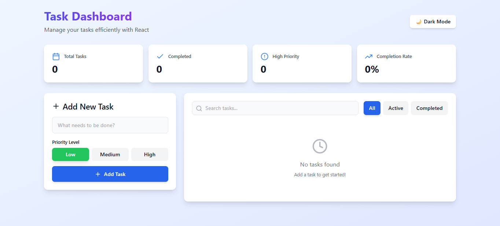
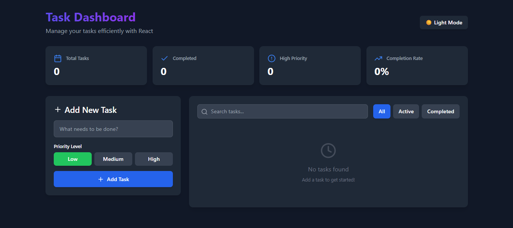
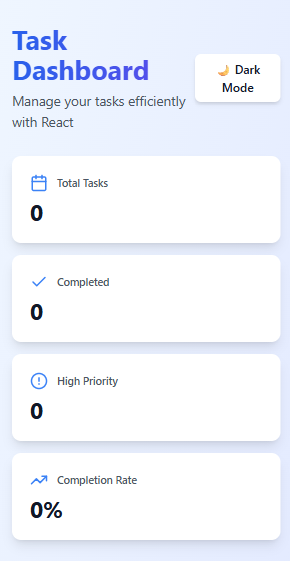

# 📋 Task Management Dashboard

A modern, responsive task management application built with React, demonstrating best practices in component architecture, state management, and UI/UX design.

Updated by AI agent



## ✨ Features

- ✅ Create, complete, and delete tasks
- 🎯 Priority levels (Low, Medium, High)
- 🔍 Real-time search functionality
- 🎨 Filter by status (All, Active, Completed)
- 🌓 Dark/Light mode with preference persistence
- 💾 Data persistence using localStorage
- 📊 Real-time statistics dashboard
- 📱 Fully responsive design
- ⚡ Performance optimized with React hooks

## 🚀 Live Demo

**[View Live Demo](https://task-management-dashboard-52nexmvf2.vercel.app/)**

## 📸 Screenshots

### Light Mode


### Dark Mode


### Mobile View


## 🛠️ Technologies Used

- **React 18** - UI library
- **React Hooks** - useState, useEffect, useReducer, useMemo, useContext
- **Context API** - Global state management
- **Tailwind CSS** - Utility-first styling
- **Lucide React** - Icon library
- **localStorage** - Data persistence

## 📦 Installation

1. **Clone the repository**
```bash
git clone https://github.com/saloni129/task-management-dashboard.git
cd task-management-dashboard